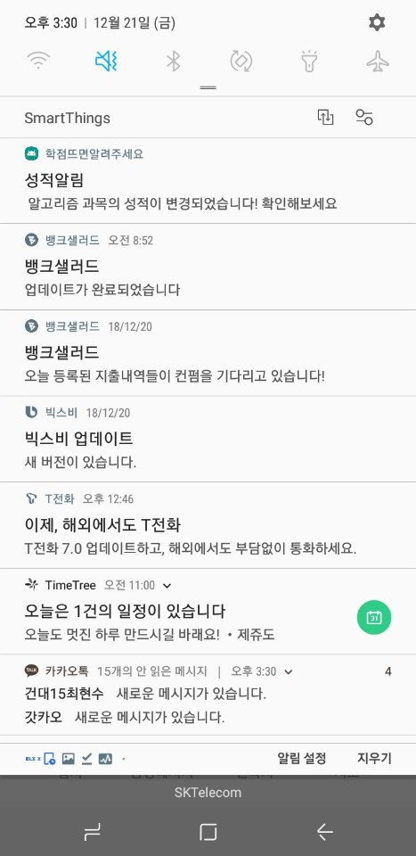
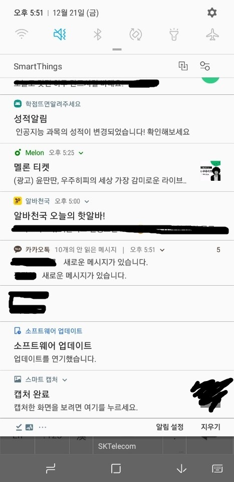
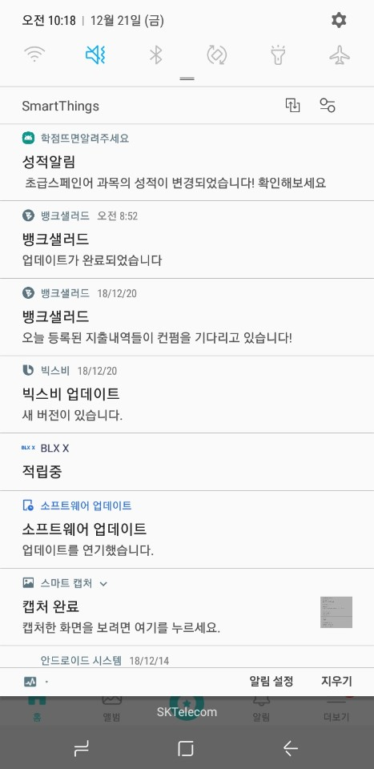
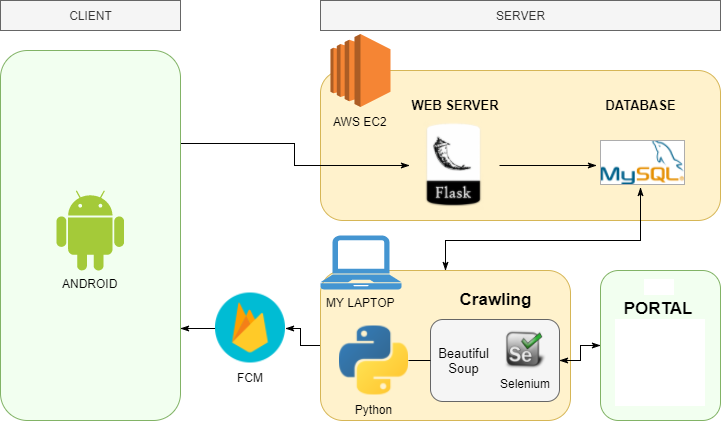
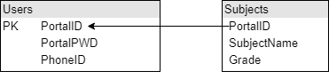

# AlarmGrade
성적이 업데이트 되면 푸쉬 알림을 보내주는 어플리케이션입니다. (건국대학교 전용)  
Application that sends push alarm when grade is updated! (only for Konkuk Univ.)  

## Contents  
1. 개발 진행 사항  
2. 기술 스택 및 용도  
3. 문제 해결  
4. 아쉬웠던 점 및 개선 목표  
---
### 개발 진행 사항  
 <푸쉬 알림 예시>  

  
안드로이드 클라이언트 측에서 로그인 정보를 입력하면, 로그인 정보와 함께 푸쉬 알림을 보내기 위한 핸드폰 정보가 같이 서버로 전송됩니다.  
DB에 저장된 로그인 정보들로 포탈에 접속해 성적 정보를 크롤링합니다.  
이 때, 로그인 암호화와 자바스크립트 렌더링 문제를 활용하기 위해 셀레늄이 사용되었습니다.  
셀레늄과 뷰리풀수프를 이용해 과목과 성적 정보를 크롤링하여 db에 저장합니다.  
이 때, 이미 저장되어 있던 정보와 비교해 성적 정보가 갱신되었으면 FCM을 이용해 해당 Portal ID가 가진 PhoneID로 푸쉬 메세지를 전송합니다.
안드로이드 클라이언트 측에서는 전송된 과목 정보를 받아 푸쉬 알림을 띄워줍니다.

### 기술 스택 및 용도  
  

Client측 어플리케이션은 안드로이드 기반으로 작성되었고,  
아직 포탈 로그인 정보를 서버로 전송하는 기능 + 푸쉬 메세지를 받는 기능만 구현되었습니다.  

웹 서버는 아마존 EC2에서 1년간 Free tier로 제공하는 t2.micro 컴퓨터를 활용,  
python flask로 구축하였고 DB는 MYSQL로 구축하였습니다.

Database skima  
  
※ 절대 이렇게 짜면 안된다는 것을 알고 있습니다

크롤링은 포탈 로그인 암호화 문제 때문에 셀레늄을 사용하였고,  
때문에 t2.micro 컴퓨터로는 시간상 여러 명이 사용하기에 무리가 있다고 판단되어  
현재 임시로 제 컴퓨터로 크롤링을 수행하도록 구현하였습니다. 

푸쉬 메세지는 Firebase Cloud Message 서비스를 이용하였습니다.  
주기적으로 크롤링 하면서 db에 저장된 성적 정보가 갱신되면 현재 ID에 해당하는 기기에 푸쉬 알람을 띄우도록 합니다.
### 문제 해결  
1. 포탈 로그인 암호화 문제 + 자바스크립트 렌더링 문제
 > 포탈 로그인은 단순히 서버로 아이디와 비밀번호를 전송하는 것이 아니라 아이디와 비밀번호를 암호화하여 서버로 전송하기 때문에 직접 요청을 보낼수가 없고, 또 자바스크립트에 의해 html이 동적으로 생성되기 때문에 일반적인 방법으로 크롤링 할 수 없었습니다. 따라서 셀레늄을 활용해 실제로 웹 브라우저를 사용하여 접근하고 자바스크립트를 렌더링 한 후 원하는 정보에 접근하는 방식을 선택하였습니다. 이 방식은 어떤 페이지든 크롤링 할 수 있지만, 로그인하고 자바스크립트를 렌더링 하는 과정에서 시간이 많이 소요됩니다.  
2. 서버로 사용할 컴퓨터 문제
 > 처음 생각으로는 작업도 단순하고 당연히 AWS EC2 free tier로 가능할 줄 알았지만, 셀레늄을 이용하면서부터 EC2로는 크롤링을 진행하면 할수록 점점 시간이 더 많이 소모되는 것을 확인하였습니다. t2.micro의 성능이 부족한 것 같아 임시로 제 노트북을 사용하여 크롤링을 수행하니 비교적 빠른 시간안에 진행되었습니다.
 
### 아쉬웠던 점 및 개선 목표  
앞으로 할 일이 많습니다 ㅠ

1. 포탈 로그인 암호화 문제
 > 가능한 얘기인지는 모르겠지만, 암호화 되는 방식을 알 수 있다면 로그인 정보를 서버에서 직접 암호화 시켜 전송하면 셀레늄을 이용하지 않고도 로그인 할 수 있을 것으로 생각합니다. 그렇게 되면 현재보다 시간을 단축시킬 수 있게 됩니다.
2. 역시나 시간 문제 -> 서버에 직접 접근할 수만 있다면..
 > 아무리 로그인에 걸리는 시간을 줄인다고 해도 결국 웹 포탈에서 원하는 정보를 가져오려면 자바스크립트를 렌더링 해야합니다. 이는 결국 셀레늄을 사용해야 한다는 소리고, 즉 시간 문제로 AWS EC2 대신 제 컴퓨터를 사용해야 하는 문제가 남게 됩니다. 하지만 로그인 정보를 가지고 서버에 직접 접근할 수 있다면 셀레늄으로 자바스크립트를 렌더링 할 필요 없이 빠른 시간안에 원하는 정보를 가져올 수 있게 됩니다. 할 수만 있다면 최선책이지만 여러가지 보안적인 이슈로 인해 학교측에서 허락해 주지 않을 것 같습니다.
3. DB에 저장되는 로그인 정보의 보안 문제
 > 현재는 기능이 잘 작동하는지에 중점을 맞춰 개발했기 때문에 DB에 Portal ID,Password가 그대로 저장됩니다. 절대 이렇게 하면 안되기 때문에 암호화된 상태로 저장하거나 저장을 하지 않거나 다른 로그인 정보를 저장하거나 하는 등의 해결책이 필요합니다.
4. 안드로이드 어플리케이션 업데이트
 > 현재는 기능 테스트를 위해 로그인 창만 덩그러니 있는 모습이지만, 성적도 띄워주고 아이콘도 디자인하고 로그인 예외처리도 해야 합니다.
 
 
